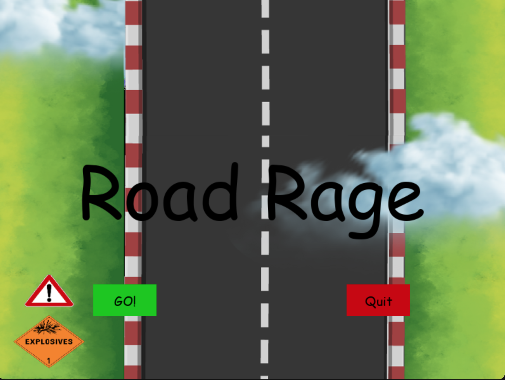

# Road Rage Game

Welcome to Road Rage, a simple pygame-based car dodging game! Dodge the incoming cars and see how many you can avoid before crashing. 

Embark on a journey through the intensity of road rage, where the urban streets echo with the rush of speeding vehicles and the occasional unexpected collision WHACK!!. If you've ever felt the adrenaline of dodging cars in a city, this game is for you. Get ready for a thrilling experience and showcase your mastery of the road! ZOOM ZOOOM ZOOOOOOOM! Its time to Start the game. Good Luck!

## How to Play

- Use the **arrow keys** or **W, A, S, D keys** to control your car's movement.
- Press **P** to pause the game.
- Dodge the incoming cars to stay alive.
- Your goal is to survive as long as possible and dodge as many cars as you can.

## Dependencies

Make sure you have Python and Pygame installed:

```bash
pip install pygame
```

## How to Run

1. Clone the repository:

```bash
git clone https://github.com/your-username/road-rage-game.git
cd road-rage-game
```

2. Run the game:

```bash
python road_rage_game.py
```

## Controls

- **Arrow keys or W, A, S, D keys**: Control car movement.
- **P key**: Pause the game.

## Gameplay

- Dodge incoming cars to stay alive.
- The speed of the cars will increase as you progress.
- Collect hearts to replenish your health.

## Credits

- Game developed by Isamar, Tom and Lohan
- Background images from canva.com designed by unknown
- Car images from canva.com designed by Isamar
- Sound effects from apple music

Enjoy playing Road Rage! If you encounter any issues or have suggestions for improvement. Have fun! 🚗💨
